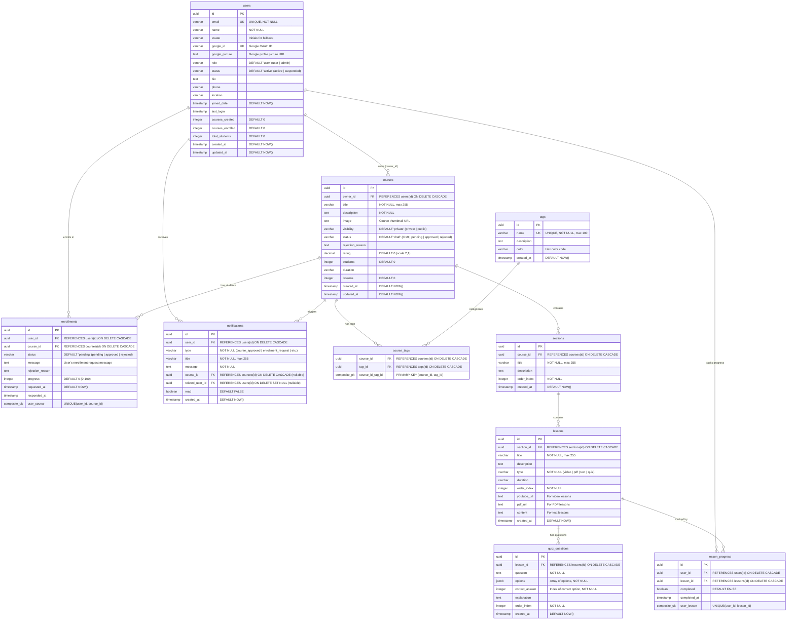

# EduLearn Platform - Entity Relationship Diagram (ERD)

## Database Schema Overview

Hệ thống sử dụng **PostgreSQL** thông qua **Supabase** với 9 bảng chính để quản lý người dùng, khóa học, nội dung, đăng ký học và thông báo.

---

## ERD Diagram



---

## Relationships Explained

### 1. Users ↔ Courses (One-to-Many)
- **Quan hệ**: Một user có thể tạo nhiều khóa học
- **Foreign Key**: `courses.owner_id` → `users.id`
- **Cascade**: `ON DELETE CASCADE` - Xóa user sẽ xóa tất cả khóa học của họ

### 2. Courses ↔ Tags (Many-to-Many)
- **Quan hệ**: Một khóa học có nhiều tags, một tag thuộc nhiều khóa học
- **Junction Table**: `course_tags` với composite primary key `(course_id, tag_id)`
- **Cascade**: Xóa course hoặc tag sẽ xóa liên kết trong `course_tags`

### 3. Courses ↔ Sections (One-to-Many)
- **Quan hệ**: Một khóa học có nhiều sections (mục)
- **Foreign Key**: `sections.course_id` → `courses.id`
- **Ordering**: Sử dụng `order_index` để sắp xếp

### 4. Sections ↔ Lessons (One-to-Many)
- **Quan hệ**: Một section có nhiều lessons (bài học)
- **Foreign Key**: `lessons.section_id` → `sections.id`
- **Ordering**: Sử dụng `order_index` để sắp xếp

### 5. Lessons ↔ Quiz Questions (One-to-Many)
- **Quan hệ**: Một lesson kiểu quiz có nhiều câu hỏi
- **Foreign Key**: `quiz_questions.lesson_id` → `lessons.id`
- **Conditional**: Chỉ áp dụng khi `lessons.type = 'quiz'`

### 6. Users ↔ Courses via Enrollments (Many-to-Many)
- **Quan hệ**: Một user đăng ký nhiều courses, một course có nhiều students
- **Junction Table**: `enrollments` với status tracking
- **Unique Constraint**: `UNIQUE(user_id, course_id)` - Không cho phép đăng ký trùng

### 7. Users ↔ Lessons via Lesson Progress (Many-to-Many)
- **Quan hệ**: Track progress của từng user trên từng lesson
- **Junction Table**: `lesson_progress`
- **Unique Constraint**: `UNIQUE(user_id, lesson_id)` - Mỗi user chỉ có 1 progress record per lesson

### 8. Notifications
- **user_id**: Người nhận notification
- **course_id**: Khóa học liên quan (nullable)
- **related_user_id**: User liên quan (ví dụ: student yêu cầu đăng ký) (nullable)

---

## Key Database Features

### 1. **UUID Primary Keys**
- Tất cả bảng sử dụng `UUID` thay vì integer để tránh collision và tăng bảo mật

### 2. **Timestamps**
- Mọi bảng có `created_at` (DEFAULT NOW())
- Một số bảng có `updated_at` để track changes

### 3. **Cascading Deletes**
- **ON DELETE CASCADE**: Xóa parent sẽ xóa children
  - users → courses
  - courses → sections, enrollments, course_tags
  - sections → lessons
  - lessons → quiz_questions, lesson_progress
  
- **ON DELETE SET NULL**: Xóa parent sẽ set NULL
  - notifications.related_user_id

### 4. **Unique Constraints**
- `users.email` - UNIQUE
- `users.google_id` - UNIQUE
- `tags.name` - UNIQUE
- `(user_id, course_id)` trong `enrollments` - UNIQUE
- `(user_id, lesson_id)` trong `lesson_progress` - UNIQUE

### 5. **Default Values**
- Role: 'user'
- Status: 'active' (users), 'draft' (courses), 'pending' (enrollments)
- Visibility: 'private'
- Rating: 0
- Counters: 0
- Booleans: FALSE

---

## Data Integrity Rules

### 1. **Course Status Workflow**
```
draft → (if public) → pending → approved/rejected
      → (if private) → stays draft (ready to use)
```

### 2. **Enrollment Workflow**
```
pending → approved/rejected (by course owner)
```

### 3. **Lesson Types**
- `video`: Requires `youtube_url`
- `pdf`: Requires `pdf_url`
- `text`: Requires `content`
- `quiz`: Links to `quiz_questions` table

---

## Indexes (Recommended)

```sql
-- User lookups
CREATE INDEX idx_users_email ON users(email);
CREATE INDEX idx_users_google_id ON users(google_id);

-- Course queries
CREATE INDEX idx_courses_owner_id ON courses(owner_id);
CREATE INDEX idx_courses_status ON courses(status);
CREATE INDEX idx_courses_visibility ON courses(visibility);

-- Enrollment lookups
CREATE INDEX idx_enrollments_user_id ON enrollments(user_id);
CREATE INDEX idx_enrollments_course_id ON enrollments(course_id);
CREATE INDEX idx_enrollments_status ON enrollments(status);

-- Lesson progress
CREATE INDEX idx_lesson_progress_user_id ON lesson_progress(user_id);
CREATE INDEX idx_lesson_progress_lesson_id ON lesson_progress(lesson_id);

-- Notifications
CREATE INDEX idx_notifications_user_id ON notifications(user_id);
CREATE INDEX idx_notifications_read ON notifications(read);
```

---

**Created**: 2025-01-15  
**Database**: PostgreSQL via Supabase  
**Total Tables**: 9  
**Total Relationships**: 11
