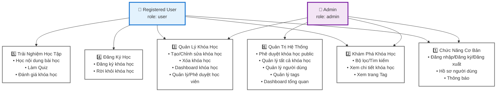

# EduLearn Platform - Use Case Diagram

## System Actors

1. **Registered User** - Người dùng đã đăng nhập (role: user)
2. **Course Owner** - User đã tạo khóa học (owner của course)  
3. **Admin** - Quản trị viên hệ thống (role: admin)

**Lưu ý**: Tất cả features đều yêu cầu authentication. Không có Guest User access.

---

## Use Case Diagram



**Giải thích Use Cases:**

### 👤 Registered User (20 use cases)
- **Chức năng cơ bản**: Login/Logout, Profile, Notifications
- **Khám phá**: Tìm kiếm, lọc, xem khóa học và tags
- **Quản lý khóa học**: Tạo/sửa/xóa khóa học của mình, quản lý học viên
- **Đăng ký học**: Enroll/Leave courses
- **Học tập**: Học video/PDF/text, làm quiz, đánh giá

### 👤 Admin (25 use cases)
- **Tất cả quyền của User** (có thể tạo khóa học như user thường)
- **Quản trị đặc biệt**:
  - Phê duyệt khóa học public (xem nội dung chi tiết + quiz answers)
  - Quản lý TẤT CẢ khóa học (public + private)
  - Quản lý người dùng (xem/xóa)
  - Quản lý tags
  - Dashboard analytics tổng quan hệ thống

---

## Detailed Use Cases by Feature Group

### 1. Authentication & Profile Management

#### UC-1: Đăng nhập với Google OAuth
- **Actor**: Guest User, Registered User, Admin
- **Description**: Đăng nhập bằng tài khoản Google
- **Flow**:
  1. Click "Sign in with Google"
  2. Redirect to Google OAuth
  3. User authorizes
  4. Google returns user info (email, name, picture, google_id)
  5. Backend checks if user exists
  6. If NOT → Create new user with role 'user'
  7. If YES → Update last_login
  8. Return JWT token
  9. Frontend stores token + user info
- **Postcondition**: User logged in, redirected to HomePage

#### UC-2: Đăng nhập Demo Account
- **Actor**: Guest User (Development only)
- **Description**: Đăng nhập nhanh bằng 1 trong 4 demo accounts
- **Flow**:
  1. User clicks on demo account button
  2. Auto-fill credentials
  3. Login immediately
- **Postcondition**: User logged in as selected demo account

#### UC-3: Đăng xuất
- **Actor**: Registered User, Admin
- **Description**: Logout khỏi hệ thống
- **Flow**:
  1. Click "Đăng xuất" button
  2. Clear JWT token
  3. Clear user state
  4. Redirect to LoginPage

#### UC-4: Xem thông tin cá nhân
- **Actor**: Registered User, Admin
- **Description**: Xem profile của mình
- **Page**: AccountSettingsPage
- **Data**: Avatar, name, email, phone, bio, location, stats

#### UC-5: Chỉnh sửa hồ sơ
- **Actor**: Registered User, Admin
- **Description**: Cập nhật thông tin cá nhân
- **Editable Fields**: Avatar, phone, bio, location
- **Validation**: Character limits apply

---

### 2. Course Discovery & Browsing

#### UC-6: Xem trang chủ
- **Actor**: Registered User, Admin
- **Page**: HomePage
- **Description**: Hiển thị khóa học public đã được duyệt
- **Filter**: visibility='public' AND status='approved'
- **Features**: Statistics section, Featured courses, Filter by tags

#### UC-7: Khám phá khóa học
- **Actor**: Registered User, Admin
- **Page**: ExplorePage
- **Features**: Search, Filter (tags, rating, students), Sort (newest, popular, rating)

#### UC-8: Lọc khóa học theo tags
- **Actor**: All users
- **Description**: Click on tag to see related courses
- **Filter**: Courses with selected tag

#### UC-9: Tìm kiếm khóa học
- **Actor**: Registered User
- **Input**: Search query
- **Search Fields**: Course title, description, owner name

#### UC-10: Xem chi tiết khóa học
- **Actor**: Registered User, Admin (with different permissions)
- **Page**: CourseDetailPage
- **Tabs**: 
  - Tổng quan (description)
  - Chương trình học (sections + lessons)
  - **Xem nội dung chi tiết** (Admin only - for approval)
  - Đánh giá (reviews)
- **Actions**: Vary by role (see UC-30 to UC-42)

#### UC-11: Xem chi tiết chủ đề
- **Actor**: Registered User, Admin
- **Page**: TagDetailPage
- **Display**: Tag info + All courses with this tag

---

### 3. Course Creation & Management (User/Owner)

#### UC-12: Tạo khóa học mới
- **Actor**: Registered User, Admin
- **Page**: CreateCoursePage
- **Steps**:
  1. **Step 1**: Basic info (title, description, overview, image, tags, visibility)
  2. **Step 2**: Content (sections → lessons)
  3. Validation checklist
  4. Submit
- **Visibility Options**:
  - Private → status='draft' (ready to use immediately)
  - Public → status='pending' (wait for admin approval)

#### UC-13: Chỉnh sửa khóa học
- **Actor**: Course Owner, Admin
- **Page**: EditCoursePage
- **Permission Check**: Must be owner OR admin
- **Features**: Same as CreateCoursePage + Load existing data

#### UC-14: Xóa khóa học
- **Actor**: Course Owner, Admin
- **Permission**: Owner can delete their own, Admin can delete any
- **Cascade**: Delete sections, lessons, quiz_questions, enrollments

#### UC-15: Xem khóa học của tôi
- **Actor**: Registered User
- **Page**: MyCoursesPage
- **Tabs**:
  - **Đã tạo**: Courses where ownerId = currentUser.id
  - **Đang học**: Enrolled courses with progress

#### UC-16: Thêm sections và lessons
- **Actor**: Course Owner
- **Part of**: CreateCoursePage, EditCoursePage
- **Features**: 
  - Add/remove sections
  - Inline edit section titles (click to edit)
  - Reorder with drag-drop or order_index

#### UC-17: Tạo quiz với QuizEditor
- **Actor**: Course Owner
- **Component**: QuizEditor (shared component)
- **Input Methods**:
  - **Format Input**: Paste text with special syntax
  - **Manual Input**: Add questions one by one
  - **LLM Prompt**: Copy prompt → Use ChatGPT/Claude → Paste result
- **Question Types**: Single choice, Multiple choice
- **Fields**: Question, options, correct answers, explanation

#### UC-18: Upload file PDF
- **Actor**: Course Owner
- **Description**: Upload PDF for lesson type='pdf'
- **Backend**: Supabase Storage
- **Frontend**: PDF Viewer (no download option)

#### UC-19: Thêm YouTube video
- **Actor**: Course Owner
- **Input**: YouTube URL (max 200 chars)
- **Validation**: Extract video ID
- **Frontend**: YouTube embed player

---

### 4. Enrollment & Learning (Student)

#### UC-20: Đăng ký học khóa học
- **Actor**: Registered User
- **Trigger**: Click "Đăng ký học" on CourseDetailPage
- **Flow**:
  1. User writes enrollment message
  2. Submit request → Create enrollment with status='pending'
  3. Owner receives notification (type='enrollment_request')
  4. Owner approves/rejects
  5. User receives notification (type='enrollment_approved' or 'enrollment_rejected')

#### UC-21: Rời khỏi khóa học
- **Actor**: Enrolled User
- **Location**: MyCoursesPage → Tab "Đang học"
- **Features**:
  - "Rời khỏi" button on each enrolled course card
  - Confirm dialog with warning about losing progress
  - Delete enrollment record
  - Delete all lesson_progress for this user+course

#### UC-22: Xem khóa học đang học
- **Actor**: Registered User
- **Page**: MyCoursesPage → Tab "Đang học"
- **Display**: Course cards with progress bars

#### UC-23: Theo dõi tiến độ học
- **Actor**: Enrolled User
- **Calculate**: (completedLessons / totalLessons) × 100
- **Display**: Progress bar on course cards and learning page

---

### 5. Learning Experience

#### UC-24: Học bài - Video YouTube
- **Actor**: Enrolled User, Owner
- **Page**: LearningPage
- **Type**: lesson.type = 'video'
- **Display**: YouTube embed player (responsive, fullscreen support)

#### UC-25: Học bài - PDF Viewer
- **Actor**: Enrolled User, Owner
- **Page**: LearningPage
- **Type**: lesson.type = 'pdf'
- **Display**: iframe PDF viewer
- **Security**: **NO download option** (view only)

#### UC-26: Học bài - Text Content
- **Actor**: Enrolled User, Owner
- **Page**: LearningPage
- **Type**: lesson.type = 'text'
- **Display**: Markdown renderer (formatted content)

#### UC-27: Làm Quiz có timer
- **Actor**: Enrolled User, Owner
- **Page**: QuizPage
- **Type**: lesson.type = 'quiz'
- **Features**:
  - Countdown timer (if quizSettings.timeLimit exists)
  - Single/multiple choice questions
  - Submit when done or time's up
  - Calculate score

#### UC-28: Đánh dấu hoàn thành bài học
- **Actor**: Enrolled User
- **Action**: Click "Đánh dấu hoàn thành" button
- **Effect**:
  - Create/update lesson_progress with completed=true
  - Update enrollment.progress
  - Update lesson list UI (✅ icon)

#### UC-29: Xem kết quả quiz
- **Actor**: Enrolled User
- **Display**: Score, correct/incorrect answers, explanations
- **Security**: Quiz answers should NOT be visible during quiz
- **Note**: Admin can see correct answers when previewing (UC-38)

---

### 6. Course Management (Owner)

#### UC-30: Xem dashboard khóa học
- **Actor**: Course Owner
- **Page**: CourseDashboardPage
- **Permission**: Must be owner of the course
- **Quick Info Cards**:
  - Total students
  - Average rating
  - Pending enrollment requests (highlight if > 0)
- **Tabs**:
  - Yêu cầu đăng ký (pending enrollments)
  - Đánh giá (reviews from students)

#### UC-31: Quản lý học viên
- **Actor**: Course Owner
- **Page**: CourseStudentsPage
- **Permission**: Must be owner
- **Tab "Tất cả"**: Approved students
- **Tab "Chờ duyệt"**: Pending enrollment requests
- **Features**: Search, View student info, Kick out

#### UC-32: Duyệt yêu cầu đăng ký
- **Actor**: Course Owner
- **Trigger**: Student requests enrollment
- **Action**: Click "Duyệt" on enrollment request
- **Effect**:
  - Update enrollment.status = 'approved'
  - Set enrollment.responded_at = now()
  - Send notification to student (type='enrollment_approved')
  - Student can now access course

#### UC-33: Từ chối yêu cầu đăng ký
- **Actor**: Course Owner
- **Action**: Click "Từ chối", enter reason
- **Effect**:
  - Update enrollment.status = 'rejected'
  - Set enrollment.rejection_reason
  - Set enrollment.responded_at = now()
  - Send notification to student (type='enrollment_rejected')

#### UC-34: Xóa học viên khỏi khóa học
- **Actor**: Course Owner
- **Action**: Kick student out
- **Effect**:
  - Delete enrollment record
  - Delete all lesson_progress for this student+course
  - Optionally send notification

#### UC-35: Mời học viên trực tiếp
- **Actor**: Course Owner
- **Page**: CourseStudentsPage → Button "Thêm học viên"
- **Flow**:
  1. Open dialog
  2. Search users in system
  3. Select user
  4. Send invitation
  5. Create enrollment with status='approved' (directly approved)

#### UC-36: Xem yêu cầu đăng ký chờ duyệt
- **Actor**: Course Owner
- **Page**: CourseDashboardPage, CourseStudentsPage
- **Display**: List of pending enrollments with user info and message

---

### 7. Admin - Course Approval & Management

#### UC-37: Xem danh sách khóa học chờ duyệt
- **Actor**: Admin
- **Page**: ApproveCoursesPage
- **Filter**: visibility='public' AND status='pending'
- **Display**: Course cards with owner info, creation date, lessons count

#### UC-38: Xem nội dung chi tiết khóa học
- **Actor**: Admin
- **Page**: CourseDetailPage → Tab "Xem nội dung chi tiết"
- **Purpose**: Kiểm duyệt chất lượng nội dung trước khi approve
- **Special Feature**: **ADMIN-ONLY tab**
- **Layout**:
  - Left (2/5): Sections + lessons list (collapsible)
  - Right (3/5): Content preview
- **Preview Types**:
  - Video: YouTube embed (can play)
  - Text: Full content display
  - PDF: PDF viewer
  - Quiz: Questions + **ALL OPTIONS + HIGHLIGHT CORRECT ANSWERS** + Explanations
- **Security**: Backend MUST check user.role='admin' before returning correctAnswers

#### UC-39: Duyệt khóa học public
- **Actor**: Admin
- **Action**: Click "Duyệt" after reviewing content
- **Effect**:
  - Update course.status = 'approved'
  - Course appears on HomePage (public + approved)
  - Send notification to owner (type='course_approved')

#### UC-40: Từ chối khóa học public
- **Actor**: Admin
- **Action**: Click "Từ chối", enter rejection_reason
- **Effect**:
  - Update course.status = 'rejected'
  - Set course.rejection_reason
  - Send notification to owner (type='course_rejected')
  - Owner can fix and resubmit

#### UC-41: Quản lý tất cả khóa học
- **Actor**: Admin
- **Page**: ManageCoursesPage
- **View**: **ALL courses** (public + private, all statuses)
- **Filters**:
  - Search (title, owner)
  - Visibility (all, public, private)
  - Status (all, pending, approved, rejected)
  - Tags (all, specific tag)
- **Stats Cards**: Total, Public, Private, Pending

#### UC-42: Xóa khóa học vi phạm
- **Actor**: Admin
- **Permission**: Can delete ANY course
- **Action**: Click "Xóa" with confirm dialog
- **Effect**: DELETE course + cascade to sections, lessons, enrollments, etc.

---

### 8. Admin - User Management

#### UC-43: Xem danh sách người dùng
- **Actor**: Admin
- **Page**: ManageUsersPage
- **Display**: Table with avatar, name, email, role, courses, join date

#### UC-44: Xem chi tiết người dùng
- **Actor**: Admin
- **Page**: UserDetailPage
- **Info**: Personal info, stats
- **Tabs**:
  - Khóa học đã tạo
  - Khóa học đang học (with progress)

#### UC-45: Xóa người dùng
- **Actor**: Admin
- **Action**: Click "Xóa" with confirm dialog
- **Effect**: DELETE user + cascade to their courses, enrollments, progress

#### UC-46: Lọc người dùng
- **Actor**: Admin
- **Filters**:
  - Search (name, email)
  - Role (all, user, admin)
  - Status (all, active, suspended)

---

### 9. Admin - Tag Management

#### UC-47: Xem danh sách tags
- **Actor**: Admin
- **Page**: ManageTagsPage
- **Display**: Grid cards with icon, name, color, course count, description

#### UC-48: Tạo tag mới
- **Actor**: Admin
- **Action**: Click "Tạo tag mới"
- **Dialog Fields**: Name (unique), color (hex), icon, description
- **Validation**: Name must be unique

#### UC-49: Chỉnh sửa tag
- **Actor**: Admin
- **Action**: Click "Sửa" on tag card
- **Editable**: Name, color, icon, description

#### UC-50: Xóa tag
- **Actor**: Admin
- **Action**: Click "Xóa" on tag card
- **Warning**: If tag is used by courses, confirm deletion
- **Effect**: DELETE tag + remove from course_tags

---

### 10. Notifications System

#### UC-51: Nhận thông báo real-time
- **Actor**: Registered User, Admin
- **Trigger**: Important events (course approved, enrollment request, etc.)
- **Types**:
  - course_approved
  - course_rejected
  - enrollment_request (for owner)
  - enrollment_approved (for student)
  - enrollment_rejected (for student)
  - student_joined (for owner)
  - course_completed (for student)

#### UC-52: Xem danh sách thông báo
- **Actor**: Registered User, Admin
- **Location**: Header notification icon
- **Display**: Dropdown with list, unread count badge, bell animation

#### UC-53: Đánh dấu đã đọc
- **Actor**: Registered User, Admin
- **Actions**:
  - Click notification → mark as read
  - "Đánh dấu tất cả đã đọc" button

#### UC-54: Click thông báo auto-navigate
- **Actor**: Registered User, Admin
- **Flow**:
  1. Click notification
  2. Mark as read
  3. Auto-navigate to related page (e.g., CourseDetailPage, CourseDashboardPage)
  4. Close notification dropdown

---

### 11. Admin Dashboard & Analytics

#### UC-55: Xem dashboard tổng quan
- **Actor**: Admin
- **Page**: AdminDashboardPage
- **Purpose**: Overview of entire system

#### UC-56: Xem thống kê hệ thống
- **Actor**: Admin
- **Stats Cards**:
  - Total users
  - Total courses
  - Courses pending approval
  - Total students (sum of all enrollments)

#### UC-57: Xem biểu đồ phân tích
- **Actor**: Admin
- **Charts**:
  - Pie chart: Courses by tag
  - Bar chart: New users by month
  - Line chart: Enrollment trends

#### UC-58: Xem top giảng viên
- **Actor**: Admin
- **Display**: Table with top instructors (by students, courses, rating)

---

## Permission Matrix

| Feature | User | Owner | Admin |
|---------|------|-------|-------|
| View public courses | ✅ | ✅ | ✅ |
| View private courses (own) | ✅ | ✅ | ✅ |
| View all private courses | ❌ | ❌ | ✅ |
| Create course | ✅ | ✅ | ✅ |
| Edit own course | ✅ | ✅ | ✅ |
| Delete own course | ✅ | ✅ | ✅ |
| Delete any course | ❌ | ❌ | ✅ |
| Approve public course | ❌ | ❌ | ✅ |
| Enroll in course | ✅ | ✅ | ✅ |
| Manage students (own course) | ✅ | ✅ | ✅ |
| Manage all users | ❌ | ❌ | ✅ |
| Manage tags | ❌ | ❌ | ✅ |
| View admin dashboard | ❌ | ❌ | ✅ |
| View quiz answers (preview) | ❌ | ❌ | ✅ |

**Lưu ý**: Tất cả tính năng yêu cầu đăng nhập. Không có guest access.

---

## Key User Flows

### Flow 1: Tạo và Publish Khóa Học Public
```
User → CreateCoursePage
  → Fill basic info (title, description, tags)
  → Choose visibility = "public"
  → Add sections and lessons
  → Submit → status = "pending"
  → Admin receives notification
  → Admin → ApproveCoursesPage
  → Admin views course detail (with content preview)
  → Admin approves → status = "approved"
  → Owner receives notification (course_approved)
  → Course appears on HomePage
```

### Flow 2: Đăng Ký và Học Khóa Học
```
Student → HomePage/ExplorePage
  → Find course → CourseDetailPage
  → Click "Đăng ký học"
  → Write message → Submit enrollment (status = "pending")
  → Owner receives notification (enrollment_request)
  → Owner → CourseDashboardPage or CourseStudentsPage
  → Owner approves enrollment
  → Student receives notification (enrollment_approved)
  → Student → CourseDetailPage → "Bắt đầu học"
  → Student → LearningPage
  → Watch videos, read text, take quizzes
  → Mark lessons as completed
  → Progress updates automatically
```

### Flow 3: Admin Kiểm Duyệt Khóa Học
```
User creates public course → status = "pending"
  → Admin → ApproveCoursesPage
  → Admin sees pending course
  → Admin → CourseDetailPage → Tab "Xem nội dung chi tiết"
  → Admin reviews ALL content:
      - Video URLs (can play)
      - PDF files (can view)
      - Text content (reads)
      - Quiz questions + CORRECT ANSWERS (highlighted)
  → Admin decides quality:
      ✅ Good → Approve → status = "approved"
      ❌ Poor → Reject (with reason) → status = "rejected"
  → Owner receives notification
```

---

## System Constraints

1. **Authentication Required**: ALL features require login (UC-1 or UC-2). Không có guest access
2. **Role-Based Access**: Admin features (UC-37 to UC-58) only for role='admin'
3. **Ownership Check**: Course management features require ownership OR admin role
4. **Enrollment Required**: Learning features require approved enrollment
5. **Status Workflow**: Public courses must be approved before visible on HomePage
6. **Data Validation**: All inputs have character limits and validation rules
7. **Cascade Deletes**: Deleting parent records deletes children (courses → sections → lessons)

---

**Total Use Cases**: 58  
**Total Actors**: 3 (User, Owner, Admin)  
**Total Pages**: 19  
**Authentication**: Required for ALL features  
**Created**: 2025-01-15
